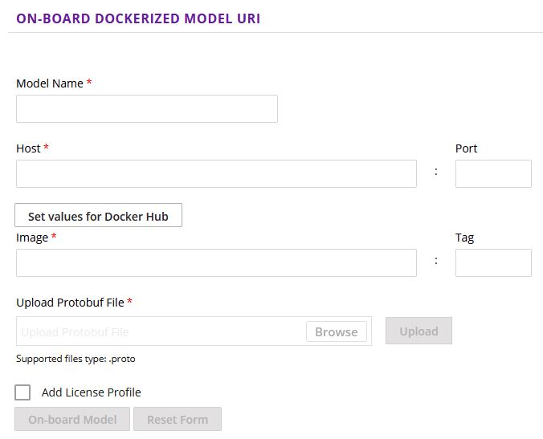

# AI4EU development guide

## Material & Platforms

* [AI4EU platform](https://www.ai4europe.eu/) - Login with ECAS.
* [AI4EU experiments platform](https://aiexp.ai4europe.eu/#/home) - Login with new account.
* [AI4EU youtube channel](https://www.youtube.com/channel/UC0TvS1wLb1Qja9k-dle0cdQ/videos). Video tutorials included.
* [AI4EU github tutorials](https://github.com/ai4eu/tutorials). Specifically, some of the most important:
  * [AI4EU container specifications](https://github.com/ai4eu/tutorials/tree/master/Container_Specification)
  * [House Prediction Example](https://github.com/ai4eu/tutorials/tree/master/House_Price_Prediction)
* [Sudoku example github](https://github.com/peschue/ai4eu-sudoku). Another useful example.
* [AI4EU github channel](https://github.com/ai4eu). For more information on how the services are executed (not necessary), orchestrators implementations can be consulted.
  * [Generic serial orchestrator](https://github.com/ai4eu/generic-serial-orchestrator) : [main file](https://github.com/ai4eu/generic-serial-orchestrator/blob/main/orchestrator_container/generic_serial_orchestrator.py) . This kind of orchestrator was used in our examples. **UPDATE 29/10: parallel orchestrator is used now. Our examples were tested with serial**
  * [Parallel orchestrator](https://github.com/ai4eu/generic-parallel-orchestrator). It was supported in later stage than serial. Not used so far in our examples. **UPDATE 29/10: downloading onboarded solution uses parallel orchestrator now**
* Deliverables & Presentation:
  * I-NERGY D4.1 Section 6.1 documents load-forecasting service.
  * I-NERGY Consortium Document library/ WPs/ WP2/ T2.4/ AI4EU concepts/ AI4EU_experiments.pptx
* Other example project available in VesselAI gitlab (epu).

## Development process

The steps for developing a service include briefly:

* **Model development and training**. For an example case of a pretrained model, a python function "wrapping" the model will provide the interface to the to-be-developed service, which in turn will use this interface to consume the underlying model.
* **Protobuf definition**. This .proto file defines the interface of the service and the format of the exchanged messages/data using the protocol buffers language.
* **Messages, service, client classes generation**. In this step the protocol buffer compiler, *protoc*, is used to generate the code (classes) for client and server, as well as the classes of the exchanged messages according to the protobuf file.
* **gRPC server implementation**. Server code shall implement the interface described in the .proto file. Therefore, for a prediction service, it will receive a request from a client and will propagate the payload, possibly including some tranformation or other logic to the trained model.
* **gRPC client implementation**. Client implementation is not necessary for onboarding process. It is used for local development and testing of the gRPC service (e.g., sending request/data to service to receive prediction).
* **Dockerise application**. Create Docker file for application. Build image and test the application.
* **Onboarding process**
  * Build, tag & push image to a docker hub repository. Repository can be private at first and then prior to publication of the service it can be switched to public.
  * Onboard model via AI4EU experiments user interface.
  * Verify onboarding.
* **Publish service**. Follow steps in UI to publish model.

More information for each individual steps is provided below.

## Model development and training

See [I-NERGY forecasting example](predict_total_load.py)

## Protobuf Definition

* See [I-NERGY forecasting example protobuf](load_prediction.proto)

For more details following resources are useful:

* [Protocol Buffers Language Guide](https://developers.google.com/protocol-buffers/docs/proto3)
* [Protocol Buffers Language Python Tutorial](https://developers.google.com/protocol-buffers/docs/pythontutorial)

## Messages, service, client classes generation

Install packages and generate the classes.

```python
# install packages
python -m pip install grpcio
python -m pip install grpcio-tools
# generate classes
python -m grpc_tools.protoc -I. --python_out=. --grpc_python_out=. <protobuf_file_name>.proto
#This will generate the files ending with _pb2_grpc.py (containes client service classes) & _pb2.py (contains message classes)
```

## gRPC server implementation

**1 - Start with implementing service class:**

```python
import load_prediction_pb2
import load_prediction_pb2_grpc

class PredictLoadServicer(load_prediction_pb2_grpc.PredictLoadServicer):
    def GetLoadPrediction(self, request, context):
        # return load_prediction_pb2.Prediction()
        return load_prediction_pb2.Prediction(load = response.values, datetime = response.index.values )
```

We can see that the imported and generated (in previous step) class is used i.e.:

```python
class PredictLoadServicer(load_prediction_pb2_grpc.PredictLoadServicer):
```

**2 - Then, the goal is to implement the service interface defined in .proto i.e.:**

```protobuf
service PredictLoad {
  rpc GetLoadPrediction(Input) returns (Prediction);
}
```

Therefore, code defines the function and shall return instance of *Prediction* class, i.e.:

```python
def GetLoadPrediction(self, request, context):
        # return load_prediction_pb2.Prediction()
        return load_prediction_pb2.Prediction(load = response.values, datetime = response.index.values )
```

**3 - Creating the function running the server and the main block calling the serve function:**

```python
def serve():
    server = grpc.server(futures.ThreadPoolExecutor(max_workers=10))
    load_prediction_pb2_grpc.add_PredictLoadServicer_to_server(PredictLoadServicer(), server)
    server.add_insecure_port(('{}:{}').format(config['server']['host'], config['server']['port']))
    server.start()
    logging.info('load_predict server starts listening at {}:{}'.format(config['server']['host'], config['server']['port']))
    server.wait_for_termination()

if __name__ == '__main__':
    logging.basicConfig(level=logging.DEBUG)
    with open("config.yml", "r") as ymlfile:
        config = yaml.safe_load(ymlfile)
    serve()
```

Assigning values of server host & port thourgh reading them from an external file (config.yml) is optional.

**4 - Finally, write service logic and import all necessary packages.**
See [I-NERGY forecasting example server](predict_load_server.py)

**Notice**
At this step, keep in mind that depending on the stage of the service inside pipeline different conditions shall be met.  
For instance, according to [container specifications](https://github.com/ai4eu/tutorials/tree/master/Container_Specification) the first node of a pipeline shall receive as input an empty message.  
In addition, the terminating condition of the pipeline shall be implemented in a node of the pipeline.

Currently, as implemented in generic serial orchestrator and listed below, the supported terminating conditions include `grpc.StatusCode.OUT_OF_RANGE` & `grpc.StatusCode.NOT_FOUND`. **UPDATED 29/10: parallel orchestrator is used now and therefore terminating conditions should be verified**

However, the following conditions contain a bug since "grpc.StatusCode.OUT_OF_RANGE" is a string and not the value of grpc.StatusCode.OUT_OF_RANGE. Thereofore using this condition as the terminating one will result to an infinite run of the pipeline.

```python
if previous_response is None:
    """This is for the first Node i.e Databroker in the pipeline which according to ai4eu container 
    specification has empty input type"""
    request_1 = request_method()
    try:
        response_1 = response_method(request_1)
    except grpc.RpcError as rpc_error_call:
        if str(rpc_error_call.code()) == "StatusCode.NOT_FOUND" or \
                str(rpc_error_call.code()) == "grpc.StatusCode.OUT_OF_RANGE":
            grpc_exception_flag = True
        print("errcode=" + str(rpc_error_call.code()))
        print("message=" + rpc_error_call.details())
else:
    try:
        response_1 = response_method(previous_response)
    except grpc.RpcError as rpc_error_call:
        if str(rpc_error_call.code()) == "StatusCode.NOT_FOUND" or \
                str(rpc_error_call.code()) == "grpc.StatusCode.OUT_OF_RANGE":
            grpc_exception_flag = True
        print("errcode=" + str(rpc_error_call.code()))
        print("message=" + rpc_error_call.details())
```

An example how a terminating condition is returned is provided below:

```python
def GetLoadPrediction(self, request, context):
    # repsonse instance
    response = load_prediction_pb2.Prediction()
    context.set_details('more details about the reponse here')
    context.set_code(grpc.StatusCode.OUT_OF_RANGE)
    return response
```

***For more information about gRPC:***

* [Quickstart](https://grpc.io/docs/languages/python/quickstart/)
* [Basics tutorial](https://grpc.io/docs/languages/python/basics/)
* [gRPC python examples repo - github](https://github.com/grpc/grpc/tree/v1.41.0/examples/python)

## gRPC client implementation

Full code [here](predict_load_client.py)

```python
# create channel
# create stub
# call service passing input according to protobuf
with grpc.insecure_channel(("{}:{}").format(config["client"]["host"], config["client"]["port")) as channel:
    stub = load_prediction_pb2_grpc.PredictLoadStub(channel)
    response = stub.GetLoadPrediction(load_prediction_pb2.Input(
        days_to_append=SAMPLE_DATA["days_to_append"],
        days_ahead=SAMPLE_DATA["days_ahead"],
        daily_steps=SAMPLE_DATA["daily_steps"],
        news=SAMPLE_DATA["news"],)
        ) 
```

For local testing, the server should start:

```bash
# start server
python predict_load_server.py
# run client
python predict_load_client.py
```

## Dockerise application

An example Dockerfile is provided below.  
See also [container specifications](https://github.com/ai4eu/tutorials/tree/master/Container_Specification).

```Dockerfile
# base image
FROM python:3.9-slim

RUN pip install --upgrade pip
# switch to non-root user
RUN adduser app
USER app
WORKDIR /home/app
# copy requirements.txt containing the packages for installation
COPY --chown=app:app requirements.txt requirements.txt
# install packages
RUN pip install -r requirements.txt
# Copy all files inside current directory and according to dockerignore
COPY --chown=app:app . .
# compile the prote to generate classes
RUN python3 -m grpc_tools.protoc -I. --python_out=. --grpc_python_out=. load_prediction.proto
# requirement for AI4EU, expose the service port 8061
EXPOSE 8061

# port 8062 should be exposed when UI is available for service listening at 8061
# EXPOSE 8062

# start server
ENTRYPOINT python3 ./predict_load_server.py
```

To build, name and tag image:

```bash
# build image from dockerfile with name=myimage and tag=1.0
docker build -t myimage:1.0
```

Run container:

```bash
# run container, port mapping is used in order service be reachable from host at port 8061
docker run -p 8061:8061 --rm -ti myimage:1.0 /bin/bash
```

Then to run service, open a new terminal and execute:

```bash
python predict_route_client.py
```

For debugging purposes sometimes access to container is useful.

```bash
# locate container id
docker ps
# run shell inside container (-u 0 as root)
docker exec -it -u 0 <container-id> /bin/bash
```

To upload image to dockerhub retag and push image.  
A repository shlould have been created earlier.

```bash
# rename image
docker tag myimage:1.0 myrepo/myimage:1.0
# push
docker push myrepo/myimage:1.0
```

## Onboard service

To onboard service use GUI of AI4EU experiments platform.


Host = `docker.io`   Port: empty
If not working try: `index.docker.io`
Image e.g.= `myrepo/myimage Tag = 1.0`
Upload protobuf
License optional at this step.

Verify onboarding by:

* On-boarding history status
* if MY MODELS/MODEL/SIGNATURE is not created, onboarding is not successful.
* Inspect MY MODELS/MODEL/Model Artifacts/OnBoardingLog-1.0.0.txt for potential errors
* if nothing indicates failure in onboarding logs (common problems include protobuf syntax, or comments) repeat onboarding (it may take up to 3-4 times to succeed)

**The usage of onboarding service will be presented in seperate section.**

## Publish service

To publish service

* Go to MY MODELS
* Select model
* Press "manage my model"
* Complete "manage publisher/author" & "publish to marketplace"
* Approval of publish is async (~ 2-3 days)

## Download and run onboarded service

Till now, 2 types of services were tested.

1. Single Service. (e.g., I-NERGY load forecasting)
2. A composite solution (pipeline), where 2 seperate services were onboarded individually, and they were connected to each other in the design studio.

### Case 1: Single Service

To download service:

* Go to "MY MODELS"
* Select model & "deploy"
* "Deploy to local"
* Extract downloaded solution
* Folder will include: `deployments` , `microservice`, `deployment-readme.txt`, `kubernetes-client-script.py`

To run service:

* A kubernetes cluster is required.
  * For local k8s [minikube](https://minikube.sigs.k8s.io/docs/start/) can be used. (docker desktop includes kubernetes and can be enabled via application/settings/kubernetes)
  * It is convenient to install [kubectl](https://kubernetes.io/docs/tasks/tools/#kubectl). `minikube kubectl` can be used also. See [minikube interact with your cluster](https://minikube.sigs.k8s.io/docs/start/)
* Start k8s. `minikube start`
* Create k8s namespace: `kubectl create ns <namespace_name>`
* Run setup script: `python .\kubernetes-client-script.py -n <namespace_name>`
* See pods status: `kubectl get pods –n <namespace_name>`.
  * Some time is required till pods go to 'running' state.
  * To see more info about a specific pod: `kubectl describe pod <pod_name> -n <namespace>`
  * To restart a pod we can simply delete it: `kubectl delete pod <pod_name> -n <namespace>`
* To see services. `kubectl get svc -n <namespace>`. [More info here](https://kubernetes.io/docs/tasks/access-application-cluster/service-access-application-cluster/)
  * To see details of a service `kubectl describe svc <service_name> -n <namespace>`. Note selector & nodeport
  * Locate selector in previous output. To see ip of the node running the pods: `kubectl get pods --selector="app=mymodel" --output=wide -n <namespace>`
  * ***IMPORTANT NOTICE:*** : Depending on the virtualisation enviroment service may not be accessible in host. To enable the network connection use `minikube service --url <service-name> –n <namespace_name>`. This will fetch minikube ip and node port (and therefore can be used as an alternative for the previous 3 bullets) and it will create the network route if it does not exist.
* Access the services.
  * Use `<node_ip>` and `<node_port>` to access service. Replace these values in config.yml in order client use the right values and execute client code.
  * To see results get the logs of the pods running the service: `kubectl logs -n <namespace_name> <pod_name>`
  * Depending on the service and the minikube cluster configuration, running service will fail due to lack of memory (OOMKilled). This can be noticed through running `kubectl get pods –n <namespace_name>` and inspecting output (RESTARTS will be increased) and also running `kubectl describe pod <pod_name> -n <namespace>` looking for 'last state'. To tackle this issue minkube shall be configured with more resources than the default ones.
* Possible configurations:
  * Possible additional configuration may be required. This means that the `deployment.yaml` file inside deployments folder of the downloaded solution shall be altered appropriately. To allow changes have effect the process shall be repeated. To delete all resources in namepace and namespace itself run `kubectl delete ns <namespace>`.
  * Otherwise, to interact live with the deployments use `kubectl get deploy –n <namespace>` to locate deployment name and run `kubectl edit deploy –n <namespace> <deployment_name>` and edit deployment. This will result in redeploying application according to the new deployment.
  * Cases that this can be useful include:
    * To edit image location. (docker.io vs index.docker.io etc)
    * To add secrets [kubernetes secrets](https://kubernetes.io/docs/concepts/configuration/secret/) (useful when using image pushed in private repo, requiring to create secret with the credentials of the repo)

For debugging puproses running shell inside pod may be useful.

```bash
# with user permissions defined in dockerfile
kubectl exec --stdin --tty <pod_name> -n <namespace> -- /bin/bash
# or with root permissions
# list running containers and locate minikube container
docker ps
# get shell in node (minikube) as root
docker exec -u 0 -it <name of minikube container> /bin/bash
# alternatively
minikube ssh
# inside container
# list containers to locate the desired pod. Filter with identifier (e.g., load-forecasting)
docker ps | grep identifier
# get shell in pod as root
docker exec -u 0 -it <pod_name> /bin/bash
```

### Case 2: Composite solution

A composite solution was developed within VesselAI project.
Refer to the relevant documentation inside VesselAI / vesselai-ai4euexp-demo repository.
