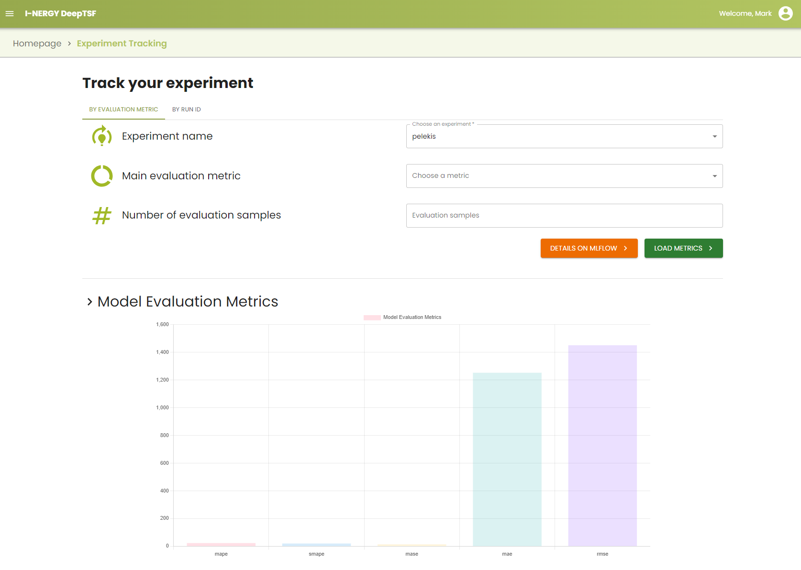
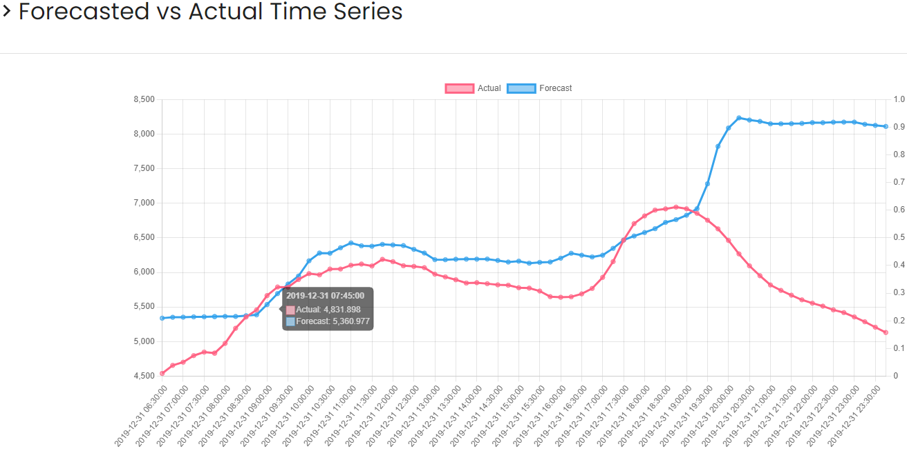
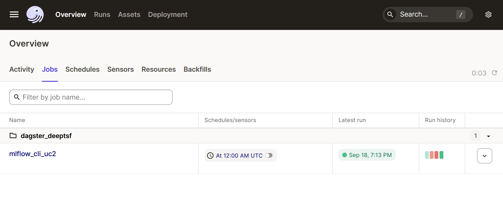
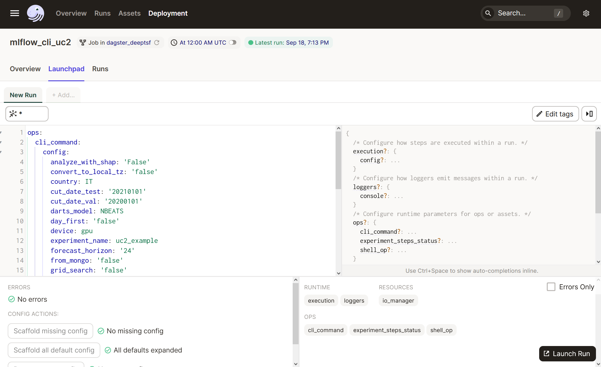
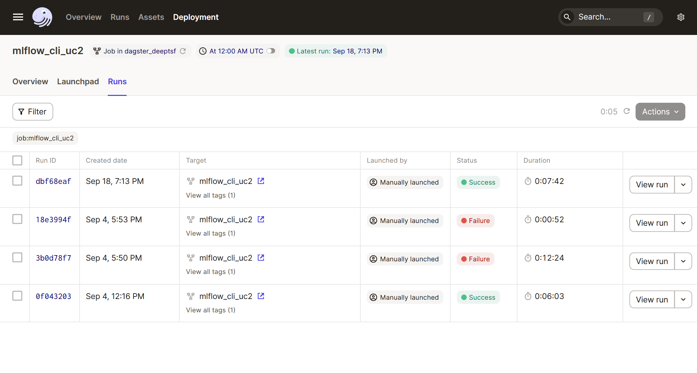
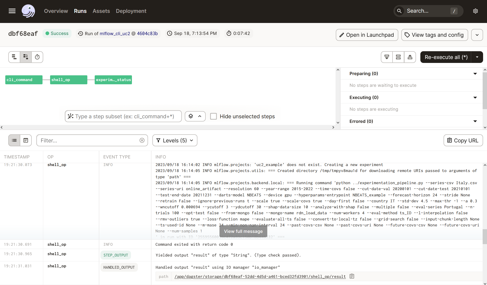

[](https://github.com/I-NERGY/DeepTSF/blob//License.txt)
# DeepTSF

This is the repository for DeepTSF timeseries forecasting tool. The whitepaper for this project can be found in [1].

## Installation

To set up DeepTSF on your local system, you need clone the main branch of this repository:

```git clone https://github.com/I-NERGY/DeepTSF.git```

Alternatively you can use the dedicated Github release instead of cloning the main branch.

After that you need to navigate to the root directory of DeepTSF:

```cd /path/to/repo/of/DeepTSF```

Το enable the communication of the client with the logging servers (MLflow, Minio, Postgres), a .env file is needed. 
An example (.env.example) is provided, with default environment variables.

After that, you can set up DeepTSF either using conda (CLI for data scientists) or Docker (full deployment).

### Set up locally using Docker (Recommended)

To set up locally using docker first go to DeepTSF's root directory and rename .env.example to .env. Then run the following command in DeepTSF's root directory:

```docker-compose up```

DeepTSF is up and running. Navigate to [http://localhost:3000](http://localhost:3000) and start your experiments!

- Optional step for advanced users: 

In a new terminal window, you can copy the timeseries file you desire to run into the container, 
and then run the following to gain access to the container's file system:

```docker cp <path_to_file> deeptsf-backend:/app```

```docker exec -it deeptsf_backend bash```

Now you are running bash in the main DeepTSF container! Choose the directory which best corresponds to your 
problem, and switch to that: <br>
- uc2 for general problems. The app will execute a national load forecasting
  use case if from_database is set to true. So preferrably set from_database=False unless you create your own database connection.<br>
- uc6 and uc7 are related to other use cases and are still under development.

So run the following to set up your working environment:
```cd uc2```

```conda activate DeepTSF_env```

```export MLFLOW_TRACKING_URI=https://localhost:5000```

```export GIT_PYTHON_REFRESH=quiet```


Then, you can execute any experiment you want. An example working command (also demonstrated in the whitepaper [1]), is shown below:

```mlflow run --experiment-name example --entry-point exp_pipeline . -P series_csv=Italy.csv -P convert_to_local_tz=false -P day_first=false -P from_database=false -P multiple=false -P l_interpolation=false -P resolution=60 -P rmv_outliers=true -P country=IT -P year_range=2015-2022 -P cut_date_val=20200101 -P cut_date_test=20210101 -P test_end_date=20211231 -P scale=true -P darts_model=NBEATS -P hyperparams_entrypoint=NBEATS_example -P loss_function=mape -P opt_test=true -P grid_search=false -P n_trials=100 -P device=gpu -P ignore_previous_runs=t -P forecast_horizon=24 -P m_mase=24 -P analyze_with_shap=False --env-manager=local```

Don't forget to change series_csv argument to match the file's location in the container 
(if you followed the previous instructions it must be located in the parent directory).

### Bare metal installation 

This installation is only recommended for advanced users that require advanced
pipeline parameterization and functionalities such as hyperparameter tuning.

#### Set up mlflow tracking server

To run DeepTSF on your system you first have to install the mlflow tracking and minio server.

```git clone https://github.com/I-NERGY/mlflow-tracking-server.git```

```cd mlflow-server```

After that, you need to get the server to run

```docker-compose up```

The MLflow server and client may run on different computers. In this case, remember to change
the addresses on the .env file.

#### Set up the DeepTSF backend (CLI functionality) locally using conda.

You can use conda.yaml to reproduce the conda environment manually. Simply 
execute the following command which creates a new conda enviroment called
DeepTSF_env:

```cd /path/to/repo/of/DeepTSF```

```conda env create -f conda.yaml```

Then activate the new environment:

```conda activate DeepTSF_env```

Alternativelly to those 2 commands, you can reproduce the conda environment automatically,
by runing any 'mlflow run' command *without* the option `--env-manager=local`. 
This option however is not encouraged for every day use as it rebuilds the conda environment from scratch every time.

Then, set the MLFLOW_TRACKING_URI to the uri of the mlflow tracking server (by default http://localhost:5000). 
Please do not omit this step as this environment variable will not get inherited from the .env file. 

```export MLFLOW_TRACKING_URI=https://localhost:5000```

## Forecasting workflow

As abovementioned, the main ML workflow comprises 4 consecutive steps,
as illustrated below. The executed
experiments are logged to the MLflow tracking server and can be
visualized by the user using the MLflow UI.

<figure id="fig:Experimentation_Pipeline">

</figure>

### Data loading

DeepTSF can handle univariate, multivariate, and multiple time series,
optionally including external variables (covariates). Firstly, the
dataset is loaded from local or online sources. Currently Deep-TSF
supports csv files of specific schema. In this context, the connectors
that enable data ingestion vary depending on the use case and the schema
of the respective data source and shall be engineered by the DeepTSF
user. We provide an example of this connector, which works with MongoDB.
After that, validation is performed to ensure that the files provided by
the user respect the required schema. The files are saved on the MLflow
tracking server so that they are available for the data pre-processing
stage.

### Data pre-processing

Then, data pre-processing is performed. Specifically, for each component
of each time series, outlier detection is optionally conducted by
removing values that differ more than an arbitrary number (defined by
the user) of standard deviations from their monthly average, or that are
zero in the case of a non-negative time series. Outliers are replaced by
missing values. Subsequently, missing data may be imputed by using a
weighted average of historical data and linear interpolation as proposed
by Peppanen et. al in \[2\].

### Training and validation

After the pre-processing stage, the data is scaled using min-max
scaling, and is split into training, validation, and testing data sets.
Then, the training of the model begins using only the training data set.
The currently supported models are N-BEATS, Transformer , NHiTS,
temporal convolutional networks, (block) recurrent neural networks,
temporal fusion transformers, LightGBM, random forest, and seasonal
naive as from the documentation of Darts forecasting models. The latter
can serve as an effective baseline depending on the seasonality of the
time series. Hyperparameter optimization can be also triggered using the
Optuna library. DeepTSF supports both exhaustive and Tree-Structured
Parzen Estimator-based \[3\] hyperparameter search. The first method
tests all possible combinations of the tested hyperparameters, while the
second one uses probabilistic methods to explore the combinations that
result to optimal values of the user-defined loss function. Ultimately,
a method based on functional analysis of variance (fANOVA) and random
forests, as proposed in \[4\], is used to calculate the importance of
each hyperparameter during optimization. In this context, a bar graph
showing the aforementioned results is produced and stored as an artifact
to MLflow.

### Evaluation and explanation

When model training is complete, evaluation is performed through
backtesting on the testing data set. Specifically, for each time series
given to the function, it consecutively forecasts time series blocks of
length equal to the forecast horizon of the model from the beginning
until the end of the test set. This operation takes place by default
with a stride equal to forecast horizon but can be changed by the user.
Then, evaluation metrics are calculated using the resulting forecasted
time series. The evaluation metrics that are supported are: mean
absolute error (MAE), root mean squared error (RMSE), min-max and mean
normalized mean squared error (NRMSE), mean absolute percentage error
(MAPE), standardized mean absolute percentage error (sMAPE), and mean
absolute scaled error (MASE). In the case of multiple time series, it is
possible for all evaluation sub-series to be tested leading to an
average value for each one of the metrics. In this case, DeepTSF stores
the results for all time series. Additionally, it is possible to analyze
the output of DL and DL models using SHapley Additive exPlanations
\[5\]. Each SHAP coefficient indicates how much the output of the model
changes, given the current value of the corresponding feature. In
DeepTSF’s implementation, the lags after the start of each sample are
considered as the features of each model. Following that, a beeswarm
plot is produced. In addition, a minimal bar graph is produced showing
the average of the absolute value of the SHAP coefficients for each
attribute. Finally, three force plot charts are produced, showing the
exact value of its SHAP coefficients for a random sample. The above
mentioned artifacts are accessible through the MLflow tracking UI.

## Input format
### Target series format 

The format of the csv files DeepTSF can accept depends on the nature of the problem it is trying to solve. More specifically, in case of a single time series file, its format is:

|Datetime | Value|
|- | -| 
|2015-04-09 00:00:00 | 7893 |
|2015-04-09 01:00:00 | 8023 |
|2015-04-09 02:00:00 | 8572 |
|... |... | 

In this table, the Datetime column simply stores the dates and times of each observation, and the Value column stores the value that has been observed.

If we are solving a multiple and / or multivariate time series problem, then the file format (along with example values) is:

|Index | Date | ID | Timeseries ID | 00:00:00 | ... |
|-|-|-|-|-|-|
0  | 2015-04-09  | PT  | PT | 5248 | ... |
1  | 2015-04-09  | ES  | ES | 25497 | ...|
... | ... | ...  | ... | ... | ...

The columns that can be present in the csv have the following meaning
- Index: Simply a monotonic integer range
- Date: The Date each row is referring to
- ID: Each ID corresponds to a component of a time series in the file. This ID must be unique for each time series component in the file. If referring to country loads it can be the country code. In this case, this will be used to obtain the country holidays for the imputation function as well as the time covariates.
- Timeseries ID (Optional): Timeseries ID column is not compulsory, and shows the time series to which each component belongs. If Timeseries ID is not present, it is assumed that each component represents one separate series (the column is set to ID).
- Time columns: Columns that store the Value of each component. They must be consecutive and separated by resolution minutes. They should start at 00:00:00, and end at 24:00:00 - resolution

The checks that are performed when validating a file are the following:

For all time series:
- The dataframe can not be empty
- All the dates must be sorted

For non-multiple time series:
- Column "Datetime" must be used as an index
- If the time series is the main dataset, "Value" must be the only other column in the dataframe
- If the time series is a covariates time series, there must be only one column in the dataframe named arbitrarily

For multiple timeseries:
- Columns Date, ID, and the time columns exist in any order
- Only the permitted column names exist in the dataframe (see Multiple timeseries file format bellow)
- All timeseries in the dataframe have the same number of components

The following example files (for the main time series tested by DeepTSF - covariates are explained further bellow) are provided in the folder example_datasets:
- single_sample_series.csv is a single time series
- multiple_sample_series.csv contains multiple time series 
- multivariate_sample_series.csv contains a multivariate time series
- multiple_and_multivariate_sample_series.csv contains multiple and multivariate time series.

### Covariate series format
In this section we are going to go into more detail about the format of the covariates that can be 
provided to DeepTSF. 

More specifically, darts has a limitation that the number of covariate
time series (past or future, if present) must be equal to the number of time series fed to the model.
So, for example, if the user wishes to train a model with 5 time series (the number of components
of each time series is irrelevant), then both the past and the future covariates must either not be used
at all or be 5. The number of components of each time series used in the covariates can be anything the user
wishes. The format that DeepTSF accepts is the same as for multiple time series. 

If the covariate time series provided by the user is one with a single component, then the user has the option to provide
that in the single time series file format, and then DeepTSF will use this as a covariate for all the main time series provided by
the user to follow the limitation of the above paragraph. In this case, the main time series can be in any format (multiple or single), and the number of time series given to the model can be anything the user wants.

If the user chooses, time covariates can be added internally. Those are considered as future covariates, and they are added
at the end of each covariate time series provided by the user as extra components. They are computed by taking into account 
each time series' calendar. If the user does not provide extra future covariates, then the time covariates that are produced are multiple time series (the same number as the main time series).

Example files are provided for future covariates in the folder example_datasets. For past covariates, the format is the same:
- future_covs_single.csv contains future covariates suitable for a single (with one or many components) timeseries
- future_covs_multiple.csv contains future covariates suitable for a problem with 2 timeseries (for multiple_and_multivariate_sample_series.csv).

## DeepTSF main graphical user interface (UI)
The DeepTSF UI runs by default at port 3000. However, this can be modified by the user. This interface allows for a completely codeless model training experience, as long as the input files respect the already described input csv file format (otherwise an error will be thrown while uploading the file). Several operations such as downsampling, outlier detection can be performed and then the user can split the dataset and perform model training by selecting the appropriate model and its respective hyperparameters. The results of the execution can be sought to the deployed MLflow server. A quick overview of the results can be also found in the experiment tracking dashboard of the front end application. Note that only purely autoregressive models can be built through the UI (with no external variables) contrary to the above described CLI. The following sub-sections describe the main functionalities of the DeepTSF front-end environment. More precisely, each page of the front-end application will be presented, along with a detailed description of the inputs and the outputs, as well as the overall functionalities it offers.

### Sign-In and homepage
The Sign-In page has been developed to provide the capability of logging into the dashboard, as illustrated below:

<figure id="fig:signin">

</figure>

After signing in, the homepage displays the main capabilities of the dashboard in head titles, as illustrated below:
<figure id="fig:homepage">

</figure>

Visually, the homepage is separated in horizontal sections, one for each one of the UI’s main functionalities.

### Codeless forecast

This page enables the execution of an experiment, after uploading the
desired dataset in csv format and configuring key parameters of the
model pre-processing, training and model evaluation steps: 

<figure id="fig:forecast">

</figure>

Note that the functionalities provided here are a subset of the operations allowed by the CLI. 
More specifically, only a small part of the pipeline parameters can be set
through the UI, while the model training can be executed for purely
autoregressive setups without the inclusion of external covariates.

In the "Dataset Configuration" section, the users can either upload
their own files or choose among the already stored ones, before
selecting the time series resolution and the dataset split that contains
the start and end dates, which represent the dates defining the
experiment execution. In the "Model Training Setup" section, the users
can define the experiment name, choose between the available algorithms
and choose between a set of hyperparameters that vary depending on the
chosen algorithm. Finally, the users have to choose a forecast horizon
for backtesting the model during evaluation. After filling all the
required fields, the “EXECUTE” button becomes available. Upon clicking
the button, an experiment with the entered configuration runs and the
user is given the choice to navigate to the MLflow tracking UI to
retrieve details about the execution.

### Experiment tracking / evaluation

This page enables a brief evaluation of the experiments’ results, by
either their name or their id as illustrated below:

<figure id="fig:experiment_forecasting">

</figure>

This page is mainly focused on users with limited modeling expertise and aims to offer them
a brief high-level overview of the results without visiting the
dedicated MLflow UI. After specifying the main evaluation metric and a
number of evaluation samples, the users can press the "DETAILS ON
MLFLOW" button, which navigates them to the MLflow instance, where they
can access a number of comprehensive experiment details. Moreover, upon
clicking the "LOAD METRICS", two charts are displayed on the bottom of
the page, as demonstrated below:

<figure id="fig:metrics">

</figure>

<figure id="fig:actualvsforecast">

</figure>

The first chart presents the model evaluation metrics of the specified
experiment, while the second one offers a visual comparison of the
actual and the forecasted load series. Note here that the actual vs
forecast plot is only available for experiments / evaluation runs that
exclusively contain univariate time series models.

### System monitoring

The system monitoring page presents a user interface that showcases
real-time data pertaining to the overall memory, GPU, and CPU
utilization of the deployed infrastructure, as illustrated below:

<figure id="fig:system_monitoring">

</figure>

The displayed data are continually refreshed at a one-second interval. To prevent overloading
the backend responsible for providing this information, the live
demonstration is limited to one minute (60 reloads). This configuration
ensures that extended periods of inactivity, such as leaving the tab
open, do not strain the backend. As a result, each section includes a
"Refresh Live Feed" button, enabling users to re-engage with the live
monitoring if desired.

## DeepTSF CLI (advanced users)

The DeepTSF CLI is a direct way of handling and triggering the workflow stages easily, automating the argument passing process and linking the execution of each script in a sequential order, passing the proper arguments from one to another. The stages of the pipeline, along with the MLflow parameters that are related to each one are presented below. Note here that this extensive documentation only refers to the CLI usage and not the DeepTSF UI whose functionalities are more limited. 

<figure id="fig:Experimentation_pipeline">

</figure>

### Data loading
Firstly, the dataset is loaded from local or online sources. Currently Deep-TSF supports csv files of the schema that is discussed in section File format. In this context, the connectors that enable data ingestion vary depending on the use case and the schema of the respective data source and shall be engineered by the DeepTSF user. We provide an example of this connector, which works with MongoDB (function load_data_to_csv in load_raw_data.py for each use case). After that, validation is performed to ensure that the files provided by the user respect the required schema. The files are saved on the MLflow tracking server so that they are available for the data pre-processing stage.


#### Parameters of the pipeline

* ```from_database``` (default false), whether to read the dataset from the database (mongodb in our case), or from other sources. If this is true, it overrides all other options (series_csv, series_uri)

* ```database_name``` (rdn_load_data), which database file to read

* ```series_uri``` (default None), the uri of the online time series file to use. If series_uri is not None, and from_database is false, then this is the time series DeepTSF will use.

* ```series_csv``` (mandatory if series_uri is None and from_database is false), the path to the local time series file to use. If series_uri has a non-default value, or if from_database is true, then series_csv has no effect.

* ```past_covs_csv``` (default None), the path to the local time series file to use as past covariates. If past_covs_uri is not None, then this has no effect.

* ```past_covs_uri``` (default None), the uri of the online time series file to use as past covariates. If past_covs_uri is not None, then this is the file DeepTSF will use as past covariates.

* ```future_covs_csv``` (default None), the path to the local time series file to use as future covariates. If future_covs_uri is not None, then this has no effect.

* ```future_covs_uri``` (default None), the uri of the online time series file to use as future covariates. If future_covs_uri is not None, then this is the file DeepTSF will use as future covariates.

* ```day_first``` (default true), whether the date has the day before the month in timeseries file.

* ```multiple``` (default false), whether the file used to extract the main series uses multiple file format. If true, the user could use multiple and / or multivariate series. This applies to the main time series. Covariates can be multivariate, but the number of time series must be the same as the main time series. The only exception to this is if we have multiple time series and a single past or future covariate. In this case, we consider this series to be the covariate to all the main time series.

### Data pre-processing

For each component of each time series, outlier detection is optionally conducted by removing values that differ more than an arbitrary number (defined by the user) of standard deviations from their monthly average, or that are zero in the case of a non-negative time series. Outliers are replaced by missing values. Subsequently, missing data may be imputed by using a weighted average of historical data and simple interpolation. This imputation method is analyzed below in more detail.

#### Imputation method
This method imputes the timeseries using a weighted average of historical data
and simple interpolation. The weights of each method are exponentially dependent on the distance to the nearest non-NaN value. More specifically, with increasing distance, the weight of simple interpolation decreases, and the weight of the historical data increases. The imputation result is calculated based on the following formulas:  

$w = e^{a d_i}$

 $result = w L + (1 - w) H$

 where $L$ is the simple interpolation, $H$ the historical data and $d_i$ the distance. $a$ is a constant that determines how quickly simple interpolation will lose its significance to the result. 
 
 The historical data that imputes a particular datetime (we will refer to it as $current$) is calculated using the average values of datetimes that fulfil all of the following conditions:

 * They have at most wncutoff distance to the current null value's
    week number (WN), where $WN = week + hour/24 + minute/(24\cdot60)$. $week$ is the day of the week (0-6) of $current$, $hour$ is the hour (0-23), and minute is the minute (0-59). wncutoff's default value (0.000694) is a little less than a minute. This means that we take into account the datetimes that have the same week, hour and minute as $current$. Holidays are handled as
    either Saturdays (if the real day is a Friday) or Sundays (in every other case).

 * They have at most ycutoff distance (in years) from the $current$'s year. 

 * They have at most ydcutoff distance (in days) from the $current$'s yearday, where yearday is the number of days that have passed since January 1st of $current$'s year. We also use mod to include the datetimes of the previous or next year that are still at most ydcutoff days away from current's yearday. The exact formula that is used is presented below:

    $(yearday - currentYearday) \mod (daysInYear) < ydcutoff$ 

    or

    $(yearday + currentYearday) \mod (daysInYear) < ydcutoff$

    where $yearday$ is the yearday of the datetime to be included in the historical forecast, $daysInYear$ are the days in the year of that datetime, and $currentYearday$ is $current$'s yearday  

* If $current$ is before cut_date_val, it is imputed using historical data
from dates which are also before cut_date_val.

 The parameters of the pipeline associated with this method are presented below, along with all parameters of data pre-processing:

#### Parameters of the pipeline
* ```resolution``` (mandatory), the resolution that all datasets will use. If this is not the resolution of a time series, then it is resampled to use that resolution. In case of single timeseries, all preprocessing is done in this resolution. In other words resampling is done before processing. In case of multiple timeseries however, the resolution is inferred from load_raw_data. All preprocessing is done using the inferred resolution and then afterwards resampling is performed. 

* ```year_range``` (default None), the years to use from the datasets (inclusive). All values outside of those dates will be dropped. If none, this has no effect on the series.

* ```time_covs``` (default false), whether to add time covariates to the time series. If true, then the following time covariates will be added as future covariates:
    * The month
    * The day of the year
    * The hour
    * The day of the week
    * The week of the year
    * Whether its a holiday or not

* ```convert_to_local_tz``` (default true), whether to convert to local time. If we have a multiple time series file, ID column is considered as the country to transform each time series' time to. If this is not a country code, then country argument is used.

* ```min_non_nan_interval``` (default 24), If after imputation there exist continuous intervals of non nan values that are smaller than min_non_nan_interval time steps, these intervals are all replaced by nan values

* ```country``` (default PT), the country code this dataset belongs to. Used to obtain holidays in case of single time series, or if id is not a valid country in case of multiple time series. Holidays are used in the imputation method, and to produce time covariates.

* ```std_dev``` (default 4.5), argument of the outlier detection method. It is the number to be multiplied with the standard deviation of each 1 month period of the dataframe. The result is then used as a cut-off value.

* ```max_thr``` (default -1), argument of the imputation method. If there is a consecutive subseries of NaNs longer than max_thr, then it is not imputed and returned with NaN values. If it is -1, every value will be imputed regardless of how long the consecutive subseries of NaNs it belongs to is.

* ```a``` (default 0.3), argument of the imputation method.
It is the weight that shows how quickly simple interpolation's weight decreases as the distance to the nearest non NaN value increases. For more information see the section about our imputation method above.

* ```wncutoff``` (default 0.000694), argument of the imputation method. Historical data will only take into account dates that have at most wncutoff distance from the current null value's WN (Week Number). 

* ```ycutoff``` (default 3), argument of the imputation method. Historical data will only take into account dates that have at most ycutoff distance from the current null value's year.

* ```ydcutoff``` (default 30), argument of the imputation method. Historical data will only take into account dates that have at most ydcutoff distance from the current null value's yearday.

* ```l_interpolation``` (default false), whether to only use linear interpolation, or use the imputation method described above

* ```rmv_outliers``` (default true), whether to remove outliers or not

* ```resampling_agg_method```(default averaging), Method to use for resampling. Choice between averaging, summation and downsampling

### Training and validation

After the pre-processing stage, the data is scaled using min-max scaling, and is split into training, validation, and testing data sets. Then, the training of the model begins using only the training data set. The currently supported models are N-BEATS , Transformer, NHiTS, temporal convolutional networks, (block) recurrent neural networks, temporal fusion transformers, LightGBM, random forest, and seasonal naive. The latter can serve as an effective baseline depending on the seasonality of the time series.

 Hyperparameter optimization can be also triggered using the Optuna library. DeepTSF supports both exhaustive and Tree-Structured Parzen Estimator-based (TPE-based) hyperparameter search. The first method tests all possible combinations of the tested hyperparameters, while the second one uses probabilistic methods to explore the combinations that result to optimal values of the user-defined loss function. Ultimately, a method based on functional analysis of variance (fANOVA) and random forests, is used to calculate the importance of each hyperparameter during optimization. It is important to note that all trials of optuna are saved locally. So, if the run of the tool is interrupted, the pipeline can be restarted with the same parameters, and optuna will resume from the last successful trial. 

 #### Providing the model's hyperparameters to DeepTSF

The user can provide hyperparameters for the model they want to train using the YAML files config.yml if hyperparameter optimization is not performed, and config_opt.yml otherwise. More specifically, the entrypoint DeepTSF will try to find is set as a parameter of the pipeline (hyperparams_entrypoint), and that needs to also exist in the corresponding file. 

In config.yml's case, the entry point will look like this:
    
    hyperparams_entrypoint:
        parameter1: value1
        parameter2: value2
        ...

Where parameter and value are each model's hyperparameter, and its desired value respectively. All model parameters not specified by the user take their default values according to Darts argument specifications.

In config_opt.yml's case, the parameters of the model that the user doesn't want to test can be given as in config.yml. The parameters that have to be tested must have their values in a list format as follows:
* Format ["range", start, end, step]: a list of hyperparameter values is considered ranging from value "start" till "end" with the step being defined by the last value of the list. 
* Format ["list", value\_1, ..., value\_n]: All the listed parameters (\{value\_1, ..., value\_n\}) are considered in the grid. 

```
hyperparams_entrypoint:
    parameter_not_to_be_tested: value1
    parameter_range:  ["range", start, end, step]
    parameter_list: ["list", value\_1, ..., value\_n]
    ...
 ```
A more specific example of this case is the following:

<figure id="fig:hyperparams">
<div class="sourceCode" id="cb1" data-fontsize="\footnotesize"
data-linenos="False" data-frame="lines" data-framesep="2mm"><pre
class="sourceCode yaml"><code class="sourceCode yaml"><span id="cb1-1"><a href="#cb1-1" aria-hidden="true" tabindex="-1"></a><span class="fu">NBEATS_example</span><span class="kw">:</span></span>
<span id="cb1-2"><a href="#cb1-2" aria-hidden="true" tabindex="-1"></a><span class="at">    </span><span class="fu">input_chunk_length</span><span class="kw">:</span><span class="at"> </span><span class="kw">[</span><span class="st">&quot;range&quot;</span><span class="kw">,</span><span class="at"> </span><span class="dv">48</span><span class="kw">,</span><span class="at"> </span><span class="dv">240</span><span class="kw">,</span><span class="at"> </span><span class="dv">24</span><span class="kw">]</span></span>
<span id="cb1-3"><a href="#cb1-3" aria-hidden="true" tabindex="-1"></a><span class="at">    </span><span class="fu">output_chunk_length</span><span class="kw">:</span><span class="at"> </span><span class="dv">24</span></span>
<span id="cb1-4"><a href="#cb1-4" aria-hidden="true" tabindex="-1"></a><span class="at">    </span><span class="fu">num_stacks</span><span class="kw">:</span><span class="at"> </span><span class="kw">[</span><span class="st">&quot;range&quot;</span><span class="kw">,</span><span class="at"> </span><span class="dv">1</span><span class="kw">,</span><span class="at"> </span><span class="dv">10</span><span class="kw">,</span><span class="at"> </span><span class="dv">1</span><span class="kw">]</span></span>
<span id="cb1-5"><a href="#cb1-5" aria-hidden="true" tabindex="-1"></a><span class="at">    </span><span class="fu">num_blocks</span><span class="kw">:</span><span class="at"> </span><span class="kw">[</span><span class="st">&quot;range&quot;</span><span class="kw">,</span><span class="at"> </span><span class="dv">1</span><span class="kw">,</span><span class="at"> </span><span class="dv">10</span><span class="kw">,</span><span class="at"> </span><span class="dv">1</span><span class="kw">]</span></span>
<span id="cb1-6"><a href="#cb1-6" aria-hidden="true" tabindex="-1"></a><span class="at">    </span><span class="fu">num_layers</span><span class="kw">:</span><span class="at"> </span><span class="kw">[</span><span class="st">&quot;range&quot;</span><span class="kw">,</span><span class="at"> </span><span class="dv">1</span><span class="kw">,</span><span class="at"> </span><span class="dv">5</span><span class="kw">,</span><span class="at"> </span><span class="dv">1</span><span class="kw">]</span></span>
<span id="cb1-7"><a href="#cb1-7" aria-hidden="true" tabindex="-1"></a><span class="at">    </span><span class="fu">generic_architecture</span><span class="kw">:</span><span class="at"> </span><span class="ch">True</span></span>
<span id="cb1-8"><a href="#cb1-8" aria-hidden="true" tabindex="-1"></a><span class="at">    </span><span class="fu">layer_widths</span><span class="kw">:</span><span class="at"> </span><span class="dv">64</span></span>
<span id="cb1-9"><a href="#cb1-9" aria-hidden="true" tabindex="-1"></a><span class="at">    </span><span class="fu">expansion_coefficient_dim</span><span class="kw">:</span><span class="at"> </span><span class="dv">5</span></span>
<span id="cb1-10"><a href="#cb1-10" aria-hidden="true" tabindex="-1"></a><span class="at">    </span><span class="fu">n_epochs</span><span class="kw">:</span><span class="at"> </span><span class="dv">300</span></span>
<span id="cb1-11"><a href="#cb1-11" aria-hidden="true" tabindex="-1"></a><span class="at">    </span><span class="fu">random_state</span><span class="kw">:</span><span class="at"> </span><span class="dv">0</span></span>
<span id="cb1-12"><a href="#cb1-12" aria-hidden="true" tabindex="-1"></a><span class="at">    </span><span class="fu">nr_epochs_val_period</span><span class="kw">:</span><span class="at"> </span><span class="dv">2</span></span>
<span id="cb1-13"><a href="#cb1-13" aria-hidden="true" tabindex="-1"></a><span class="at">    </span><span class="fu">batch_size</span><span class="kw">:</span><span class="at"> </span><span class="kw">[</span><span class="st">&quot;list&quot;</span><span class="kw">,</span><span class="at"> </span><span class="dv">256</span><span class="kw">,</span><span class="at"> </span><span class="dv">512</span><span class="kw">,</span><span class="at"> </span><span class="dv">1024</span><span class="kw">,</span><span class="at"> </span><span class="dv">1280</span><span class="kw">,</span><span class="at"> </span><span class="dv">1536</span><span class="kw">,</span><span class="at"> </span><span class="dv">2048</span><span class="kw">]</span></span></code></pre></div>
</figure>

Finally, the user can set whether to scale or not the data by including the hyperparameter
```
scale: ["list", "True", "False"]
``` 
#### Parameters of the pipeline

* ```darts_model``` (mandatory), the base architecture of the model to be trained. The possible options are:
    * NBEATS
    * NHiTS
    * Transformer
    * RNN
    * TCN
    * BlockRNN
    * TFT
    * LightGBM
    * RandomForest
    * Naive

* ```hyperparams_entrypoint``` (mandatory), the entry point containing the desired hyperparameters for the selected model. The file that will be searched for the entrypoint will be config.yml if opt_test is false, and config_opt.yml otherwise. More info for the required file format above. This field can also be a string in a json-like format (smaller than 250 characters). More specifically, the examples described in the example section above, would be in the following format if given as strings:
    * "{parameter1: value1, parameter2: value2, ...}" if no parameters require hyperparameter tuning (opt_test=false)
    * "{parameter_not_to_be_tested: value1, parameter_range:  [range, start, end, step], parameter_list: [list, value\_1, ..., value\_n], ...}" if some parameters require hyperparameter tuning (opt_test=true)

* ```cut_date_val``` (mandatory), the validation set start date (if cut_date_val=YYYYMMDD, then the validation set starts at YYYY-MM-DD 00:00:00). All values before that will be the training series. Format: str, 'YYYYMMDD'

* ```cut_date_test``` (mandatory), the test set start date (if cut_date_test=YYYYMMDD, then the test set starts at YYYY-MM-DD 00:00:00). Values between that (non inclusive) and cut_date_val (inclusive) will be the validation series. If cut_date_test = cut_date_val, then the test and validation sets will be the same (from cut_date_test to test_end_date, both inclusive). Format: str, 'YYYYMMDD'

* ```test_end_date``` (default None), the test set ending date (if test_end_date=YYYYMMDD, then the test set ends at the last datetime of YYYY-MM-DD). Values between that and cut_date_test (both inclusive) will be the testing series. All values after that will be ignored. If None, all the timeseries from cut_date_test will be the test set. Format: str, 'YYYYMMDD'

* ```device``` (default gpu), whether to run the pipeline on the gpu, or just use the cpu. 

* ```retrain``` (default false), whether to retrain model during backtesting.

* ```ignore_previous_runs``` (default true), whether to ignore previous step runs while running the pipeline. If true, all stages of the pipeline will be run again. If false, and there are mlflow runs with exactly the same parameters saved on the tracking server, the pipeline will use these results instead of executing the run again.  

* ```scale``` (default true), whether to scale the target series

* ```scale_covs``` (default true), whether to scale the covariates

* ```n_trials``` (default 100), how many trials hyperparameter optimization will run. If we run a simple grid search, this might be bigger than the possible number of parameter combinations to be tested. In this case, DeepTSF will only run the maximum possible number of combinations.

* ```opt_test``` (default false), whether we are running hyperparameter optimization or not. Also, DeepTSF will check config_opt.yml for the model parameters if this is true, and config.yml otherwise.

* ```num_workers``` (default 4), number of threads that will be used by pytorch

* ```loss_function``` (default mape), loss function to use as objective function for optuna. Possible options are:
    - mape
    - smape
    - mase 
    - mae
    - rmse
    - nrmse_max
    - nrmse_mean

* ```grid_search``` (default false), whether to run an exhaustive grid search (if true) or use the tpe method in optuna.

### Evaluation and explanation

Evaluation is performed through backtesting on the testing data set. Specifically, for each time series given to the function, it consecutively forecasts time series blocks of length equal to the forecast horizon of the model from the beginning until the end of the test set. This operation takes place by default with a stride equal to forecast horizon but can be changed by the user. 

Then, evaluation metrics are calculated using the resulting forecasted time series. The evaluation metrics that are supported are: mean absolute error (MAE), root mean squared error (RMSE), min-max and mean normalized mean squared error (NRMSE), mean absolute percentage error (MAPE), standardized mean absolute percentage error (sMAPE), and mean absolute scaled error (MASE). In the case of multiple time series, it is possible for all evaluation sub-series to be tested leading to an average value for each one of the metrics. In this case, DeepTSF stores the results for all time series. 

Additionally, it is possible to analyze the output of DL and DL models using SHapley Additive exPlanations. Each SHAP coefficient indicates how much the output of the model changes, given the current value of the corresponding feature. In DeepTSF's implementation, the lags after the start of each sample are considered as the features of each model. Following that, a beeswarm plot is produced. In addition, a minimal bar graph is produced showing the average of the absolute value of the SHAP coefficients for each attribute. Finally, three force plot charts are produced, showing the exact value of its SHAP coefficients for a random sample. The above mentioned artifacts are accessible through the MLflow tracking UI.

#### Parameters of the pipeline

* ```forecast_horizon``` (mandatory) the number of timesteps that the model being evaluated is going to predict in each step of backtesting.

* ```stride``` (default None), the number of time steps between two consecutive steps of backtesting. If it is None, then stride = forecast_horizon

* ```shap_data_size``` (default 100), The size of shap dataset in samples. The SHAP coefficients are going to be computed for this number of random samples of the test dataset. If it is a float, it represents the proportion of samples of the test dataset that will be chosen. If it is an int, it represents the absolute number of samples to be produced.

* ```analyze_with_shap``` (default false), whether to do SHAP analysis on the model.

* ```eval_series``` (mandatory if multiple=True, and evaluate_all_ts=False), on which timeseries to run the backtesting. Only for multiple timeseries. 

* ```eval_method``` (default ts_ID, only possible options are ts_ID and ID), what ID type is specified in eval_series: if ts_ID is specified, then we look at Timeseries ID column. Else, we look at ID column. In this case, all components of the timeseries that has the component with eval_series ID are used in the evaluation step. 

* ```evaluate_all_ts``` (default false), whether to validate the models for all timeseries, and return the mean of their metrics as a result. Only applicable for multiple time series. In this case, a file is produced (evaluation_results_all_ts) showing detailed results for all metrics and timeseries.  

* ```shap_input_length``` (default None), The length of each sample of the dataset used during SHAP analysis. Is taken into account only if not evaluating a model with input_chunk_length as one of its parameters. In the latter case, shap_input_length=input_chunk_length

* ```ts_used_id``` (default None), if not None, only time series with this id will be used for training and evaluation. Applicable only on multiple time series files

* ```m_mase``` (default 1), the forecast horizon of the naive method used in MASE metric

* ```num_samples``` (default 1), number of samples to use for evaluating/validating a probabilistic model's output

## DeepTSF workflow orchestrator (Dagster)
Dagster acts as a workflow orchestration engine, where data processing and ML model training pipelines, are defined as jobs. Therefore, the execution of these jobs can be scheduled in fixed intervals, serving the needs of periodic training. This component interacts with the data source, extracting the data needed for the pipelines, as well as with the model registry, where the models are stored when training is completed. More specifically, the underlying workflow is wrapped within a Dagster job consisting of two ops. The first op includes the trigger mechanism, which is the same as the underlying mechanism of the CLI tool described earlier in this section, while the second op involves a post-execution step aimed at confirming that all previous MLflow runs have been properly logged in the MLflow server. The defined job can be executed with the same configuration options that CLI provides and demonstrated in section \ref{sec:3:CLI}. Configuration can be input by users through the Dagster web server's user interface. In addition, the defined job is accompanied by a schedule which enables the periodic execution of the pipeline in order to be in sync with the periodic update of the MongoDB loading the new smart meters data. Ultimately, Dagster provides a web user interface including, among others, information regarding the defined jobs and their runs, the defined schedules, the produced assets, as well as providing the ability to configure and execute these jobs. Note here that this component is still at an experimental stage and therefore has limited features.
### Usage example
In this section, an illustrative example of the usage of the workflow
orchestrator (Dagster) within DeepTSF is provided. The demonstrated
scenario is similar to the previous section with respect to workflow
configuration options and therefore the latter are omitted.
Instead, the steps that data scientists should follow to run the
pipeline or set up scheduled executions using Dagster will be outlined.
At first, to execute the pipeline, the user should navigate as follows:

  1.  By selecting "Overview" and "Jobs" tabs yhe user is able to see the
      defined job as well as its schedule.
  
  <figure id="fig:dagster_job">
  
  </figure>
  
  2.  Enable the schedule, if needed, by using the toggle button or by
      visiting "Schedule" tab.
  
  3.  Select the job from the list.
  
  4.  On the job’s page move to Launchpad tab.

  <figure id="fig:dagster_launch">
  
  </figure>
    
  5.  Pass the appropriate configuration option and select "Launch Run".

<br/><br/>
To visualize the history of runs and their logs the user needs to:

  1.  Visit "Runs" tab, accessible from the UI’s navigation bar, where users can preview
    the different runs.
    
  <figure id="fig:dagster_runs_history">
  
  </figure>

  2.  Use the "View Run" button to see the details of a specific run.

  <figure id="fig:dagster_logs">
  
  </figure>

  3.  Inspect the logs of the execution.

Note here that the Dagster UI, allows the user to trigger experiments
with more advanced options compared to the DeepTSF UI, providing access
to most of the functionalities of the CLI. Currently, to feed their
datasets of preference, users are prompted to add their properly
formatted files in the directory uc2/user_datasets so that the
application can have direct access to them, bypassing the uploading
procedure. Also, the full range of hyperparameters can be given to the
model as a JSON string.

## Appendix: MLproject file example

The MLproject file describes the way the ML pipeline is executed. It is
in YAML format, and it defines the name of the MLflow project (in this
case DeepTSF_workflow), the file to use to build the environment the
user desires to work with (in this case conda.yaml), and the entry
points of our project.

Each entry point corresponds to a specific stage of the pipeline
describing the respective python command alongside its parameters. In
this case, each entry point runs the main python file for the stage it
corresponds to, and passes the parameters to the file using the Click
library . The file is shown below:

``` yaml
name: DeepTSF_workflow

conda_env: ../conda.yaml

entry_points:

  load_raw_data:
    parameters:
      series_csv: {type: str, default: None}
      series_uri: {type: str, default: None}
      past_covs_csv: {type: str, default: None}
      past_covs_uri: {type: str, default: None}
      future_covs_csv: {type: str, default: None}
      future_covs_uri: {type: str, default: None}
      day_first: {type: str, default: "true"}
      multiple: {type: str, default: "false"}
      resolution: {type: str, default: None}
      from_database: {type: str, default: "false"}
      database_name: {type: str, default: "rdn_load_data"}

    command: |
      python load_raw_data.py --series-csv {series_csv} --series-uri {series_uri} --day-first {day_first} --multiple {multiple} --resolution {resolution} --from-database {from_database} --database-name {database_name} --past-covs-csv {past_covs_csv} --past-covs-uri {past_covs_uri} --future-covs-csv {future_covs_csv} --future-covs-uri {future_covs_uri} 


  etl:
    parameters:
      series_csv: {type: str, default: None}
      series_uri: {type: str, default: None}
      resolution: {type: str, default: None}
      year_range: {type: str, default: None}
      time_covs: {type: str, default: "false"}
      day_first: {type: str, default: "true"}
      country: {type: str, default: "PT"}
      std_dev: {type: str, default: 4.5}
      max_thr: {type: str, default: -1}
      a: {type: str, default: 0.3}
      wncutoff: {type: str, default: 0.000694}
      ycutoff: {type: str, default: 3}
      ydcutoff: {type: str, default: 30}
      multiple: {type: str, default: "false"}
      l_interpolation: {type: str, default : "false"}
      rmv_outliers: {type: str, default: "true"}
      convert_to_local_tz: {type: str, default: "true"}
      ts_used_id: {type: str, default: None}
      infered_resolution_series: {type: str, default: "15"}
      min_non_nan_interval: {type: str, default: "24"}
      cut_date_val: {type: str, default: None}
      infered_resolution_past: {type: str, default: "15"} 
      past_covs_csv: {type: str, default: None} 
      past_covs_uri: {type: str, default: None}
      infered_resolution_future: {type: str, default: "15"} 
      future_covs_csv: {type: str, default: None} 
      future_covs_uri: {type: str, default: None}
      resampling_agg_method: {type: str, default: "averaging"}
    command: |
      python etl.py --series-csv {series_csv} --series-uri {series_uri} --resolution {resolution} --year-range {year_range} --time-covs {time_covs} --day-first {day_first} --country {country} --std-dev {std_dev} --max-thr {max_thr} --a {a} --wncutoff {wncutoff} --ycutoff {ycutoff} --ydcutoff {ydcutoff} --multiple {multiple} --l-interpolation {l_interpolation} --rmv-outliers {rmv_outliers} --convert-to-local-tz {convert_to_local_tz} --ts-used-id {ts_used_id} --infered-resolution-series {infered_resolution_series} --min-non-nan-interval {min_non_nan_interval} --cut-date-val {cut_date_val} --past-covs-csv {past_covs_csv} --past-covs-uri {past_covs_uri} --future-covs-csv {future_covs_csv} --future-covs-uri {future_covs_uri} --infered-resolution-past {infered_resolution_past}  --past-covs-csv {past_covs_csv} --past-covs-uri {past_covs_uri} --infered-resolution-future {infered_resolution_future} --future-covs-csv {future_covs_csv} --future-covs-uri {future_covs_uri} --resampling-agg-method {resampling_agg_method}

  train:
    parameters:
      series_csv: {type: str, default: None}
      series_uri: {type: str, default: None}
      future_covs_csv: {type: str, default: None}
      future_covs_uri: {type: str, default: None}
      past_covs_csv: {type: str, default: None}
      past_covs_uri: {type: str, default: None}
      cut_date_val: {type: str, default: None}
      cut_date_test: {type: str, default: None}
      test_end_date: {type: str, default: None}
      darts_model: {type: str, default: None}
      device: {type: str, default: gpu}
      hyperparams_entrypoint: {type: str, default: None}
      scale: {type: str, default: "true"}
      scale_covs: {type: str, default: "true"}
      multiple: {type: str, default: "false"}
      training_dict: {type: str, default: None}
      num_workers: {type: str, default: 4}
      day_first: {type: str, default: "true"}
      resolution: {type: str, default: None}

    command: |
      python ../training.py --series-csv {series_csv} --series-uri {series_uri} --future-covs-csv {future_covs_csv} --future-covs-uri {future_covs_uri} --past-covs-csv {past_covs_csv}  --past-covs-uri {past_covs_uri} --cut-date-val {cut_date_val} --cut-date-test {cut_date_test} --test-end-date {test_end_date} --darts-model {darts_model} --device {device} --hyperparams-entrypoint {hyperparams_entrypoint} --scale {scale} --scale-covs {scale_covs} --multiple {multiple} --training-dict {training_dict} --cut-date-val {cut_date_val} --num-workers {num_workers} --day-first {day_first} --resolution {resolution}

  eval:
    parameters:
      mode: {type: str, default: remote}
      series_uri: {type: str, default: None}
      future_covs_uri: {type: str, default: None}
      past_covs_uri: {type: str, default: None}
      scaler_uri: {type: str, default: None}
      cut_date_test: {type: str, default: None}
      test_end_date: {type: str, default: None}
      model_uri: {type: str, default: None}
      model_type: {type: str, default: pl}
      forecast_horizon: {type: str, default: None}
      stride: {type: str, default: None}
      retrain: {type: str, default: "false"}
      shap_input_length: {type: str, default: None}
      shap_output_length: {type: str, default: None}
      size: {type: str, default: 10}
      analyze_with_shap: {type: str, default: "false"}
      multiple: {type: str, default: "false"}
      eval_series: {type: str, default: None}
      cut_date_val: {type: str, default: None}
      day_first: {type: str, default: "true"}
      resolution: {type: str, default: None}
      eval_method: {type: str, default: "ts_ID"}
      evaluate_all_ts: {type: str, default: "false"}
      m_mase: {type: str, default: "1"}
      num_samples: {type: str, default: "1"}

    command: |
      python ../evaluate_forecasts.py --mode {mode} --series-uri {series_uri} --future-covs-uri {future_covs_uri} --model-type {model_type} --past-covs-uri {past_covs_uri} --scaler-uri {scaler_uri} --cut-date-test {cut_date_test} --test-end-date {test_end_date} --model-uri {model_uri} --forecast-horizon {forecast_horizon} --stride {stride} --retrain {retrain} --shap-input-length {shap_input_length} --shap-output-length {shap_output_length} --size {size} --analyze-with-shap {analyze_with_shap} --multiple {multiple} --eval-series {eval_series} --cut-date-val {cut_date_val} --day-first {day_first} --resolution {resolution} --eval-method {eval_method} --evaluate-all-ts {evaluate_all_ts} --m-mase {m_mase} --num-samples {num_samples}


  optuna_search:
    parameters:
      series_csv: {type: str, default: None}
      series_uri: {type: str, default: None}
      future_covs_csv: {type: str, default: None}
      future_covs_uri: {type: str, default: None}
      past_covs_csv: {type: str, default: None}
      past_covs_uri: {type: str, default: None}
      resolution: {type: str, default: None}
      year_range: {type: str, default: None}
      darts_model: {type: str, default: None}
      hyperparams_entrypoint: {type: str, default: None}
      cut_date_val: {type: str, default: None}
      cut_date_test: {type: str, default: None}
      test_end_date: {type: str, default: None}
      device: {type: str, default: gpu}
      forecast_horizon: {type: str, default: None}
      stride: {type: str, default: None}
      retrain: {type: str, default: false}
      scale: {type: str, default: "true"}
      scale_covs: {type: str, default: "true"}
      multiple: {type: str, default: "false"}
      eval_series: {type: str, default: None}
      n_trials: {type: str, default: 100}
      num_workers: {type: str, default: 4}
      day_first: {type: str, default: "true"}
      eval_method: {type: str, default: "ts_ID"}
      loss_function: {type: str, default: "mape"}
      evaluate_all_ts: {type: str, default: "false"}
      grid_search: {type: str, default: "false"}
      num_samples: {type: str, default: "1"}

    command: |
      python ../optuna_search.py --series-csv {series_csv} --series-uri {series_uri} --future-covs-csv {future_covs_csv} --future-covs-uri {future_covs_uri} --past-covs-csv {past_covs_csv}  --past-covs-uri {past_covs_uri} --resolution {resolution} --year-range {year_range} --darts-model {darts_model} --hyperparams-entrypoint {hyperparams_entrypoint} --cut-date-val {cut_date_val} --cut-date-test {cut_date_test} --test-end-date {test_end_date} --device {device} --forecast-horizon {forecast_horizon} --stride {stride} --retrain {retrain} --scale {scale} --scale-covs {scale_covs} --multiple {multiple} --eval-series {eval_series} --n-trials {n_trials} --num-workers {num_workers} --day-first {day_first} --eval-method {eval_method} --loss-function {loss_function} --evaluate-all-ts {evaluate_all_ts} --grid-search {grid_search} --num-samples {num_samples}


  exp_pipeline:
    parameters:
      series_csv: {type: str, default: None}
      series_uri: {type: str, default: None}
      past_covs_csv: {type: str, default: None}
      past_covs_uri: {type: str, default: None}
      future_covs_csv: {type: str, default: None}
      future_covs_uri: {type: str, default: None}
      resolution: {type: str, default: None}
      year_range: {type: str, default: None}
      time_covs: {type: str, default: "false"}
      hyperparams_entrypoint: {type: str, default: None}
      cut_date_val: {type: str, default: None}
      cut_date_test: {type: str, default: None}
      test_end_date: {type: str, default: None}
      darts_model: {type: str, default: None}
      device: {type: str, default: gpu}
      forecast_horizon: {type: str, default: None}
      stride: {type: str, default: None}
      retrain: {type: str, default: false}
      ignore_previous_runs: {type: str, default: "true"}
      scale: {type: str, default: "true"}
      scale_covs: {type: str, default: "true"}
      day_first: {type: str, default: "true"}
      country: {type: str, default: "PT"}
      std_dev: {type: str, default: 4.5}
      max_thr: {type: str, default: -1}
      a: {type: str, default: 0.3}
      wncutoff: {type: str, default: 0.000694}
      ycutoff: {type: str, default: 3}
      ydcutoff: {type: str, default: 30}
      shap_data_size: {type: str, default: 100}
      analyze_with_shap: {type: str, default: false}
      multiple: {type: str, default: "false"}
      eval_series: {type: str, default: None}
      n_trials: {type: str, default: 100}
      opt_test: {type: str, default: "false"}
      from_database: {type: str, default: "false"}
      database_name: {type: str, default: "rdn_load_data"}
      num_workers: {type: str, default: 4}
      eval_method: {type: str, default: "ts_ID"}
      l_interpolation: {type: str, default : "false"}
      rmv_outliers: {type: str, default: "true"}
      loss_function: {type: str, default: "mape"}
      evaluate_all_ts: {type: str, default: "false"}
      convert_to_local_tz: {type: str, default: "true"}
      grid_search: {type: str, default: "false"}
      shap_input_length: {type: str, default: None}
      ts_used_id: {type: str, default: None}
      m_mase: {type: str, default: "1"}
      min_non_nan_interval: {type: str, default: "24"}
      num_samples: {type: str, default: "1"}
      resampling_agg_method: {type: str, default: "averaging"}

    command: |
      python ../experimentation_pipeline.py --series-csv {series_csv} --series-uri {series_uri} --resolution {resolution} --year-range {year_range} --time-covs {time_covs} --cut-date-val {cut_date_val} --cut-date-test {cut_date_test} --test-end-date {test_end_date} --darts-model {darts_model} --device {device} --hyperparams-entrypoint {hyperparams_entrypoint} --forecast-horizon {forecast_horizon} --stride {stride} --retrain {retrain} --ignore-previous-runs {ignore_previous_runs} --scale {scale} --scale-covs {scale_covs} --day-first {day_first} --country {country} --std-dev {std_dev} --max-thr {max_thr} --a {a} --wncutoff {wncutoff} --ycutoff {ycutoff} --ydcutoff {ydcutoff} --shap-data-size {shap_data_size} --analyze-with-shap {analyze_with_shap} --multiple {multiple} --eval-series {eval_series} --n-trials {n_trials} --opt-test {opt_test} --from-database {from_database} --database-name {database_name} --num-workers {num_workers} --eval-method {eval_method} --l-interpolation {l_interpolation} --rmv-outliers {rmv_outliers} --loss-function {loss_function} --evaluate-all-ts {evaluate_all_ts} --convert-to-local-tz {convert_to_local_tz} --grid-search {grid_search} --shap-input-length {shap_input_length} --ts-used-id {ts_used_id} --m-mase {m_mase} --min-non-nan-interval {min_non_nan_interval} --past-covs-csv {past_covs_csv} --past-covs-uri {past_covs_uri} --future-covs-csv {future_covs_csv} --future-covs-uri {future_covs_uri} --num-samples {num_samples} --resampling-agg-method {resampling_agg_method}


  inference:
    parameters:
      pyfunc_model_folder: {type: str, default: s3://mlflow-bucket/2/33d85746285c42a7b3ef403eb2f5c95f/artifacts/pyfunc_model}
      forecast_horizon:  {type: str, default: None}
      series_uri: {type: str, default: None}
      past_covariates_uri: {type: str, default: None}
      future_covariates_uri: {type: str, default: None}
      roll_size: {type: str, default: 96}
      batch_size:  {type: str, default: 1}

    command: |
      python ../inference.py --pyfunc-model-folder {pyfunc_model_folder} --forecast-horizon {forecast_horizon} --series-uri {series_uri} --past-covariates-uri {past_covariates_uri} --future-covariates-uri {future_covariates_uri} --roll-size {roll_size} --batch-size {batch_size}
      
```

## References
[1]: Pelekis, S., Karakolis, E., Pountridis, T., Kormpakis, G., Lampropoulos, G., Mouzakits, S., & Askounis, D. (2023). DeepTSF: Codeless machine learning operations for time series forecasting. ArXiv https://arxiv.org/abs/2308.00709
[2]: Peppanen, J., Zhang, X., Grijalva, S., & Reno, M. J. (2016). Handling bad or missing smart meter data through advanced data imputation. 2016 IEEE Power and Energy Society Innovative Smart Grid Technologies Conference, ISGT 2016. https://doi.org/10.1109/ISGT.2016.7781213
[3]: Bergstra, J., Bardenet, R., Bengio, Y., & Kégl, B. (2011). Algorithms for Hyper-Parameter Optimization. Advances in Neural Information Processing Systems, 24. https://doi.org/https://dl.acm.org/doi/10.5555/2986459.2986743
[4]: Hutter, F., Hoos, H., & Leyton-Brown, K. (2014). An Efficient Approach for Assessing Hyperparameter Importance. In E. P. Xing & T. Jebara (Eds.), Proceedings of the 31st International Conference on Machine Learning (Vol. 32, Issue 1, pp. 754–762). PMLR.
[5]: Lundberg, S. M., & Lee, S.-I. (2017). A Unified Approach to Interpreting Model Predictions. In I. Guyon, U. von Luxburg, S. Bengio, H. Wallach, R. Fergus, S. Vishwanathan, & R. Garnett (Eds.), Advances in Neural Information Processing Systems (Vol. 30). Curran Associates, Inc. https://proceedings.neurips.cc/paper_files/paper/2017/file/8a20a8621978632d76c43dfd28b67767-Paper.pdf
